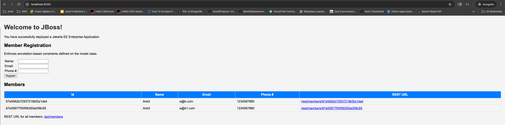

# Getting Started

### Tech Stack 
  * Java 21 and above
  * Spring
  * MongoDB

## Run on local

* Checkout this code
* Ensure you have right version of java and maven
  * Check java version `java --version`
  * Check maven installation `mvn --version` (ref https://maven.apache.org/install.html)
* You need to have mongo db running on local or cloud to connect this app
  * Verify/Update mongo db config in [application.properties](src/main/resources/application.properties) file.
* Install all dependencies
  * Run `mvn clean install` at root of this project.
* Run app
  * Run `mvn spring-boot:run`
* Once app starts successfully, you will see message like ` Tomcat started on port 8080 (http) with context path '/'`. You may need to ensure that port `8080` is not used by any other app.
* Open link http://localhost:8080/. You should see a page similar to below. 

* You can register new members. It has validations builtin.
* Similar operations can be done on below rest endpoints of the app

| Endpoint          | Method | Operation           |
|-------------------|--------|---------------------|
| /api/members      | GET    | Gets all members    |
| /api/members      | POST   | Register new member |
| /api/members/{ID} | GET    | Get member with ID  |

**Example curl**

Get all members
```shell
curl --location 'localhost:8080/api/members'
```

Register new member
```shell
curl --location 'localhost:8080/api/members' \
--header 'Content-Type: application/json' \
--data-raw '{
    "name": "Ankit",
    "email": "a@c.com",
    "phoneNumber":"1234567890"
}'
```

<hr/>
Below section describes how the migration is performed.

### Expectations
Migrate a specific legacy JBoss Java application to a more modern platform according to the following directives:

* The application for you to migrate is the ‘kitchensink’ JBoss application available in the Red Hat JBoss EAP Quickstarts GitHub repository (no need to migrate any of the other applications listed there)

* The migrated application runtime you must target is the latest stable version of Spring Boot or Quakus (your choice) based on Java 21 (you can host the running application on your laptop, in the cloud, or wherever - you don’t need to target OpenShift as the host environment necessarily, which the application’s README discusses in places).

* Create a new personal public GitHub project and host the source code for your new migrated application there (for just ‘kitchensink’ only). Include a new README where you outline the steps a developer would need to take to build and run your migrated application.

* Try to approach this migration process in the way you might do if the legacy application codebase was far larger, in terms of how you break up the problem into more management tasks, addressing the sort of infrastructure, scaffolding, and software engineering principles you would need to apply to help mitigate risk in the migration work and ensure the quality of what is migrated (during the subsequent playback session, you will be asked questions on the approach you took).

* OPTIONAL STRETCH GOAL: Modify the application to work against a MongoDB database rather than the existing relational target database.

### Playback Interview Presentation

1.5-hour presentation on Zoom to a few MongoDB staff where you will:

* Deliver a live demo of the running migrated application.

* Show what you did under the covers to perform the migration with examples of components you changed to highlight the processes you took.

* Outline any interesting aspects you learned from this process that would inform your approach to a future migration project.

* Answer questions from the interviewers on what you achieved in the migration, how you went about it, and other insights you’ve learned.

* Towardtheendofthesession, respondtoanyothermoregeneral interviewquestions youareasked.

### Running existing app

* Checkout source code with sparse checkout.
* Install Jboss EAP server. Downloaded https://developers.redhat.com/content-gateway/file/jboss-eap-7.4.0-installer.jar&v=zcVpvtVm8nE
* Follow readme to run and deploy.
* Use Java 11 for server as it does not work on Java 21.

### Steps followed to migrate app
* Source 
* Moved initial code to git
* ~~Install `brew install jboss-forge`~~
* ~~Found that JBOSS EAP is not available for public download, So moving to migration directly.~~
* Review the code, identify functionality and endpoints.
  * Three major parts of app
    * UI
    * Rest API
    * Persistence layer
* Install Spring and other dependencies and make tests work. Verifies with `mvn clean install`
* Migrate classes to Spring compatible code
* Ensure local `mvn spring-boot:run` works
* Clean-up 
* Configure mongo repo and use mongodb
  * Achieved
    * `mvn verify` works
    * Able to create, get all, get by ID using rest APIs
* Migrated frontend to thymeleaf templates
* Made some UI improvements

TODO
* Add more test cases covering validation cases.


